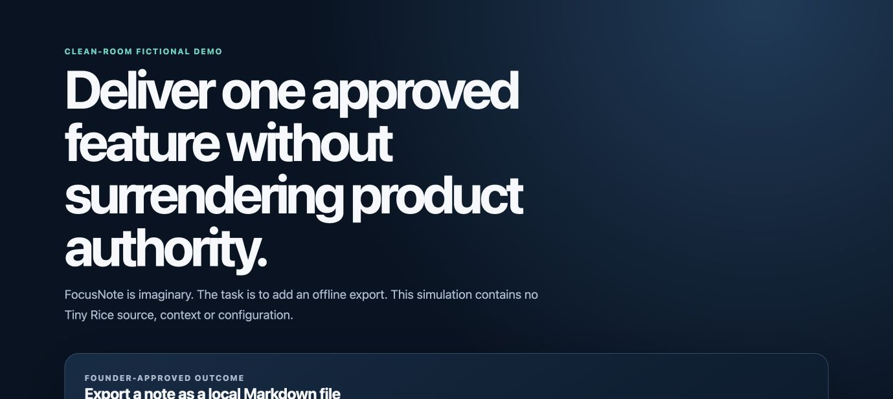

# Loop 5 — controlled delivery with AI coding agents

Loop 5 is a product-delivery system I developed while directing a private multimodal iOS product. Its purpose is simple: let AI coding agents move quickly without giving them silent authority over the product, private data, spending, credentials or publication.

## The problem

An AI agent can produce a convincing “done” message even when the accepted product outcome does not exist. Long automated sessions can also drift in scope, repeat failed work, lose evidence and blur the line between implementation and product decisions.

## My approach

I separated five things that should not be treated as one conversation:

1. a human-approved outcome and boundary;
2. bounded implementation work;
3. evidence from checks and review;
4. controlled repair when something fails; and
5. promotion of an accepted change before dependent work can continue.

The result is a review-first workflow: AI can propose and implement inside an approved envelope, while deterministic state and human authority govern what is actually accepted.

## What this public repository proves

- The product problem, operating principles and attribution can be explained publicly.
- A clean-room fictional simulation and a more detailed private case study exist.
- The public material contains no Tiny Rice source, prompts, credentials, user data, internal paths or production configuration.

## What is deliberately not public

This is not an open-source release. The reusable implementation, detailed orchestration design, interactive demo code, private evidence and the Tiny Rice repository remain private while commercial options are evaluated. A controlled walkthrough can be provided in an interview or serious diligence setting.

## My role

I defined the product outcome and constraints, reviewed trade-offs, decided where human approval was required, and directed agentic AI processes used to implement, test, audit and document the system. I present this as founder/product leadership and a system I can personally explain—not as a claim that I hand-coded every module.

© 2026 Omar Talaat. All rights reserved. See [LICENSE.md](LICENSE.md).
